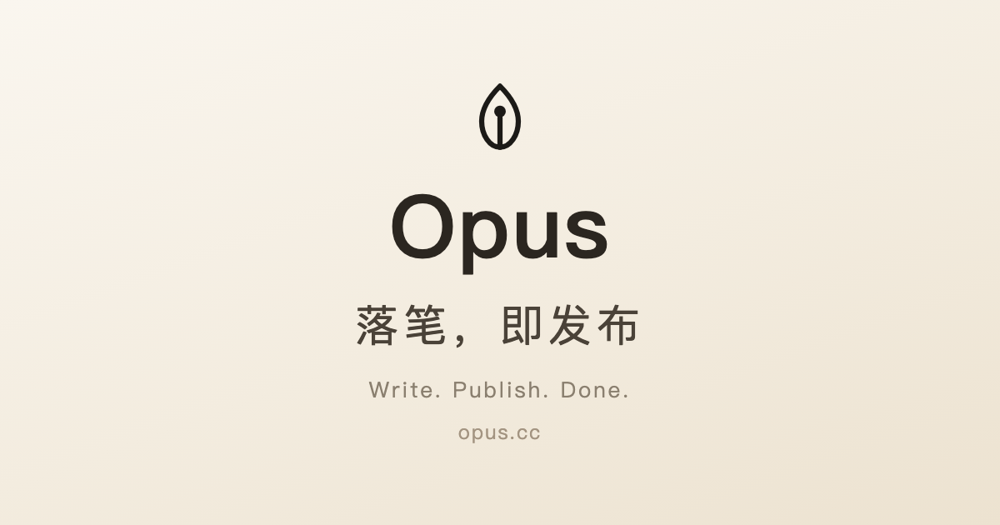

# Opus

> 落笔，即发布。/ *Write. Publish. Done.* — opus.cc

[](https://github.com/steley/opus/actions/workflows/ci.yml)

telegra.ph 风格的极简匿名发布平台：打开网页、写、点发布，即得短链。无需注册账号，
同一套代码可部署在 **Cloudflare Workers（D1）** 或任意 **VPS（Node + SQLite）**。

---

## ✨ Features

- ✅ 免注册匿名发布，生成 8 位短链（如 `opus.cc/5KHz3FbA`），自动复制到剪贴板
- ✅ 富文本编辑器：H2/H3、颜色、列表、引用、代码块、分割线、图片 / YouTube·B 站嵌入，草稿自动保存
- ✅ 阅后即焚：首次成功阅读即从数据库物理销毁
- ✅ 有效期 1 小时～365 天，到期自动删除（惰性删除，无需定时任务）
- ✅ 双密码：查看密码（阅读门槛）+ 管理密码（编辑/删除唯一凭证，PBKDF2 加盐哈希存储）
- ✅ 已发布文章可编辑：改内容、改有效期、设置/移除查看密码
- ✅ 阅读页：长文自动目录、代码块一键复制、图片灯箱、有效期本地时区提醒
- ✅ 中英双语 + 日夜双主题，零外部字体/图标库/追踪
- 🔒 人机验证（Edge Shield 页内 PoW，全浏览器兼容）+ 服务端 HTML 白名单净化
- 🚀 阅读页边缘缓存友好，Workers 免费版可支撑约 10 万次阅读/天
- 🧩 双端部署：Cloudflare Workers（D1）/ VPS（systemd + 反代）

---

## 📸 Screenshot



---

## 🛠 Tech Stack

- **前端**：Vue 3 + Vite + TipTap 3（headless 引擎，UI 全自研）
- **后端**：Hono（同构框架，Node 与 Workers 共用同一套路由）
- **数据库**：`node:sqlite` / Cloudflare D1（适配层二选一）
- **测试**：`node:test`（净化 + 路由回归，CI 跑 Node 22/24 双版本矩阵）

---

## 📦 Installation

### Requirements

- Node.js **≥ 22.13**（建议 24.x，后端使用内置 `node:sqlite`）
- npm

### Clone & install

```bash
git clone https://github.com/steley/opus.git
cd opus
npm install
```

### Run locally

```bash
npm run build          # 构建前端产物 dist/（后端托管它）
npm run dev:server     # 后端 + 静态托管 → http://localhost:8787
npm run dev            # 前端热更新 → http://localhost:5173（/api 代理到 8787）
```

---

## ⚙️ Configuration

无必填配置即可运行；以下均为可选项：

| 变量 | 端 | 说明 |
|---|---|---|
| `SHIELD_SITE_KEY` / `SHIELD_SECRET_KEY` | Workers `wrangler.toml [vars]` + `wrangler secret put`；VPS 环境变量 | Edge Shield 人机验证密钥（`es_…` / `es_secret_…`，edge.network 控制台获取）。**缺一即整体停用**（日志出现 `shield_secret_missing` / `shield_sitekey_missing` 告警），生产建议成对配置 |
| `WRITE_DB` | VPS | SQLite 文件路径，默认 `./opus.db` |
| `PORT` | VPS | 监听端口，默认 `8787` |

---

## 🚀 Deployment

### Cloudflare Workers（D1）

```bash
npx wrangler d1 create opus                                            # database_id 填入 wrangler.toml
npx wrangler d1 execute opus --remote --file schema.sql                # 建表（首次）
npx wrangler d1 execute opus --remote --file db-index.sql              # 建索引（首次）
npm run deploy                                                         # = vite build + wrangler deploy
```

绑定域名：`wrangler.toml` 中 `routes = [{ pattern = "opus.cc", custom_domain = true }]`。

### VPS（Node + SQLite）

```bash
npm ci && npm run build
node server/index.js    # 配 systemd 常驻；Caddy/Nginx 反代 + HTTPS
```

> 反代需转发 `X-Forwarded-Proto` / `X-Forwarded-Host`，文章短链才会按真实域名生成。

---

## 📖 Usage

1. 打开 opus.cc → 写标题 / 正文 → 点「发布」
2. 确认框可选：**阅后即焚**、**有效期**（默认 30 天）、**查看密码**；设定**管理密码**（≥8 位，丢失即永久锁死）
3. 确认后得到短链并自动复制，直接分享
4. 修改 / 删除：阅读页「✎ 编辑」→ 输入管理密码 → 「更新」/「删除」

---

## 🔌 API Documentation

| 方法 | 路径 | 说明 |
|---|---|---|
| POST | `/api/posts` | 发布 `{ title?, author?, html, json, burnAfterRead?, expiry?, viewPassword?, managePassword, shieldToken? }` → `{ id, url, expiresAt }`；`expiry` ∈ `1h…365d`（默认 `30d`） |
| GET | `/api/posts/:id` | 公开读取 JSON（有查看密码时 401） |
| POST | `/api/posts/:id/read` | `{ viewPassword }` 带密码读取；阅后即焚/已过期在成功访问时物理删除 |
| POST | `/api/posts/:id/edit-read` | `{ managePassword }` 编辑器读取（不触发焚毁） |
| PUT | `/api/posts/:id` | `{ managePassword, …fields }` 编辑；`viewPassword` 空串移除 / ≥4 位更新 → `{ ok, expiresAt }` |
| DELETE | `/api/posts/:id` | `{ managePassword }` 删除 |
| GET | `/:id` | 阅读页 HTML（受保护时返回密码表单；POST `/:id` 提交密码） |
| GET | `/edit/:id` | 编辑模式（前端应用，管理密码门） |

错误统一 `{ ok: false, error }`；发布与敏感读取有内存限流。

**安全模型（三层白名单）**：编辑器 schema → 粘贴过滤 → 服务端净化（`server/sanitize.js`，
sanitize-html 标签/域名/scheme 白名单，是真正的安全边界，不可绕过）。密码 PBKDF2-SHA256
加盐哈希 + 常量时间比较，错误密码延迟 300ms 防爆破。

---

## 🏗 Project Structure

```
opus/
├── src/                    # 前端
│   ├── App.vue             # 编辑器、发布流程
│   ├── api.js              # 后端 API 封装
│   ├── i18n.js / theme.js  # 中英文案 / 夜间模式
│   ├── config/whitelist.js # 媒体 URL 白名单（前端层）
│   ├── editor/             # 视频节点、粘贴过滤
│   └── components/         # Toolbar / ColorMenu / MediaDialog / PublishDialog…
├── server/                 # 后端（Node 与 Workers 共用）
│   ├── routes.js           # 全部 API + 阅读页
│   ├── db.js / db-sqlite.js# SQLite / D1 适配器
│   ├── sanitize.js         # 服务端 HTML 净化（安全边界）
│   ├── pages.js            # 阅读页 / 密码页模板
│   ├── util.js             # 短 ID / PBKDF2 / 校验
│   └── index.js            # VPS 入口
├── worker/index.js         # Cloudflare Workers 入口（D1 + Assets）
├── schema.sql / db-index.sql
└── wrangler.toml           # Workers 部署配置
```

---

## 📄 License

未指定开源许可证（保留所有权利）。欢迎按上文步骤自托管部署；二次分发 / 商用请先联系作者。
